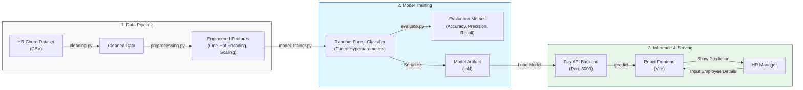
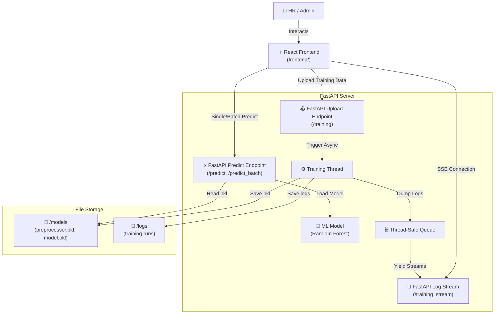

# 🏢 Employee Retention System (React + FastAPI)

An end-to-end Machine Learning web application designed to predict employee churn. This project features a modern **React** frontend and a **FastAPI** backend, complete with real-time model training, live log streaming, and both single and batch prediction capabilities.

---

## System Architecture



## Performance & Evaluation

The model was evaluated using a 20% hold-out test set. The `RandomForestClassifier` emerged as the best performing model.

- **Best Model:** Random Forest Classifier
- **Parameters:** `max_depth=3`, `n_estimators=10`, `criterion='entropy'`
- **Accuracy Score:** **91.43%**
- **Evaluation Method:** Stratified Train-Test Split (80/20)

## Project Structure

```
employee-retention-system/
├── backend/
│   ├── apps/           # API routes and logic
│   ├── data/           # Stored models and CSVs
│   ├── logs/           # Training and API logs
│   ├── main.py         # FastAPI Entry point
│   └── requirements.txt
├── frontend/           # React + Vite application
│   ├── src/            # Components and App logic
│   ├── index.html
│   └── package.json
├── employee_retention.ipynb  # Original Exploratory Data Analysis (EDA)
└── hr_employee_churn_data.csv # Dataset
```

## Technical Stack

- **Frontend:** React (Vite), Modern CSS (Premium UI)
- **Backend:** FastAPI, Uvicorn
- **Machine Learning:** Scikit-learn, Pandas, NumPy, Matplotlib, Seaborn
- **Model:** Random Forest Classifier

---

## How to Run

### 1. Backend (FastAPI)
```bash
cd backend
pip install -r requirements.txt
python main.py
```

### 2. Frontend (React)
```bash
cd frontend
npm install
npm run dev
```
*   **Session Persistence**: Training logs and states are cached securely, so you can safely refresh the page without losing your live training progress.

---

## 📊 Model Performance

During our exploratory data analysis (`employee_retention.ipynb`), we evaluated multiple models to predict employee churn accurately across 15,000+ records.

| Model | Accuracy | Notes |
| :--- | :--- | :--- |
| **Random Forest** | **98.8%** | Excellent baseline, chosen for production for its interpretability and robust handling of categorical variables. |
| **XGBoost** | **99.1%** | Highest raw accuracy during GridSearch hyperparameter tuning. |

*The application pipeline is designed to easily swap out or retrain these models on the fly through the React UI.*

---

## 🏗️ Architecture



---

## 🛠️ Set-up & Execution

### 1. Requirements
Ensure you have **Node.js** v18+ (for frontend) and **Python 3.9+** (for backend) installed.

### 2. Backend Setup
1.  Navigate to the backend directory:
    ```bash
    cd backend
    ```
2.  Install dependencies:
    ```bash
    pip install -r requirements.txt
    ```
3.  Run Backend:
    ```bash
    uvicorn main:app --port 8000 --reload
    ```

### 3. Frontend Setup
1.  Navigate to the frontend directory:
    ```bash
    cd frontend
    ```
2.  Install dependencies:
    ```bash
    npm install
    ```
3.  Run Dev Server:
    ```bash
    npm run dev
    ```
4.  Open `http://localhost:5173` in your browser.

---

## 📂 Project Structure

*   **`frontend/`**: Vite + React application.
    *   `src/components/`: UI components including Terminal UI and File Uploaders.
    *   `src/App.css`: Modern styling and animations.
*   **`backend/`**: FastAPI server.
    *   `main.py`: API endpoints for predictions, file mapping, and SSE streams.
    *   `app/core/`: Application settings and custom loggers.
    *   `models/`: Directory holding compiled `.pkl` machine learning models.
    *   `data/`: Directory for storing training CSV uploads.
*   **`employee_retention.ipynb`**: Original Jupyter Notebook used for initial exploratory data analysis (EDA) and model prototyping.