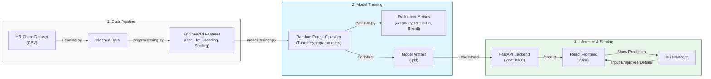

# 🏢 Employee Retention System (React + FastAPI)

An end-to-end Machine Learning web application designed to predict employee churn. This project features a modern **React** frontend and a **FastAPI** backend, complete with real-time model training, live log streaming, and both single and batch prediction capabilities.

---

## System Architecture



## Performance & Evaluation

The model was evaluated using a 20% hold-out test set. The `RandomForestClassifier` emerged as the best performing model.

- **Best Model:** Random Forest Classifier
- **Parameters:** `max_depth=3`, `n_estimators=130`, `criterion='entropy'`
- **Accuracy Score:** **91.43%** (on test set)
- **Evaluation Method:** Stratified Train-Test Split (80/20)

### 📊 Model Comparison (Grid Search Results)

During the model selection phase, several algorithms were evaluated using 5-fold Cross-Validation:

| Model | Best CV Score | Notes |
| :--- | :--- | :--- |
| **Random Forest** | **91.73%** | Robust performance, selected for final deployment. |
| **Decision Tree** | 88.77% | Good baseline but prone to higher variance. |
| **Logistic Regression** | 76.65% | Limited by linear decision boundaries. |
| **Linear SVC** | 75.04% | Similar performance to Logistic Regression. |

## Project Structure

```
employee-retention-system/
├── backend/
│   ├── apps/           # API routes and logic
│   ├── data/           # Stored models and CSVs
│   ├── logs/           # Training and API logs
│   ├── main.py         # FastAPI Entry point
│   └── requirements.txt
├── frontend/           # React + Vite application
│   ├── src/            # Components and App logic
│   ├── index.html
│   └── package.json
├── employee_retention.ipynb  # Original Exploratory Data Analysis (EDA)
└── hr_employee_churn_data.csv # Dataset
```

## Technical Stack

- **Frontend:** React (Vite), Modern CSS (Premium UI)
- **Backend:** FastAPI, Uvicorn
- **Machine Learning:** Scikit-learn, Pandas, NumPy, Matplotlib, Seaborn
- **Model:** Random Forest Classifier

---

## How to Run

### 1. Backend (FastAPI)
```bash
cd backend
pip install -r requirements.txt
python main.py
```

### 2. Frontend (React)
```bash
cd frontend
npm install
npm run dev
```
*   **Session Persistence**: Training logs and states are cached securely, so you can safely refresh the page without losing your live training progress.

---

## License

This project is licensed under the [MIT License](LICENSE).