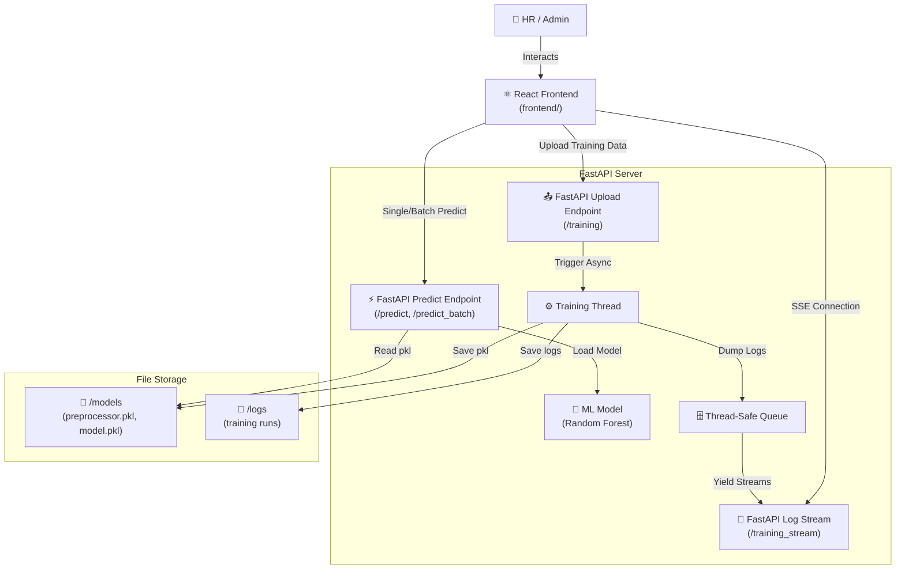

# 🏢 Employee Retention System (React + FastAPI)

An end-to-end Machine Learning web application designed to predict employee churn. This project features a modern **React** frontend and a **FastAPI** backend, complete with real-time model training, live log streaming, and both single and batch prediction capabilities.

---

## 🚀 Key Features

*   **Premium React UI**: A responsive, modern interface built with React, featuring tabbed navigation for Predictions and Model Training.
*   **Machine Learning Pipeline**: Uses a Scikit-Learn **Random Forest Classifier** with a robust data preprocessing pipeline.
*   **Real-time Model Training**: Train the model on new data directly from the UI. Features an animated, auto-scrolling terminal window that streams training logs live from the backend using Server-Sent Events (SSE).
*   **Batch Predictions**: Upload a CSV file of employee data and instantly receive bulk predictions on who is likely to leave or stay.
*   **Asynchronous Processing**: Model training runs in background threads on the FastAPI server, preventing UI blocking and allowing users to multi-task.
*   **Session Persistence**: Training logs and states are cached securely, so you can safely refresh the page without losing your live training progress.

---

## 🏗️ Architecture



---

## 🛠️ Set-up & Execution

### 1. Requirements
Ensure you have **Node.js** v18+ (for frontend) and **Python 3.9+** (for backend) installed.

### 2. Backend Setup
1.  Navigate to the backend directory:
    ```bash
    cd backend
    ```
2.  Install dependencies:
    ```bash
    pip install -r requirements.txt
    ```
3.  Run Backend:
    ```bash
    uvicorn main:app --port 8000 --reload
    ```

### 3. Frontend Setup
1.  Navigate to the frontend directory:
    ```bash
    cd frontend
    ```
2.  Install dependencies:
    ```bash
    npm install
    ```
3.  Run Dev Server:
    ```bash
    npm run dev
    ```
4.  Open `http://localhost:5173` in your browser.

---

## 📂 Project Structure

*   **`frontend/`**: Vite + React application.
    *   `src/components/`: UI components including Terminal UI and File Uploaders.
    *   `src/App.css`: Modern styling and animations.
*   **`backend/`**: FastAPI server.
    *   `main.py`: API endpoints for predictions, file mapping, and SSE streams.
    *   `app/core/`: Application settings and custom loggers.
    *   `models/`: Directory holding compiled `.pkl` machine learning models.
    *   `data/`: Directory for storing training CSV uploads.
*   **`employee_retention.ipynb`**: Original Jupyter Notebook used for initial exploratory data analysis (EDA) and model prototyping.